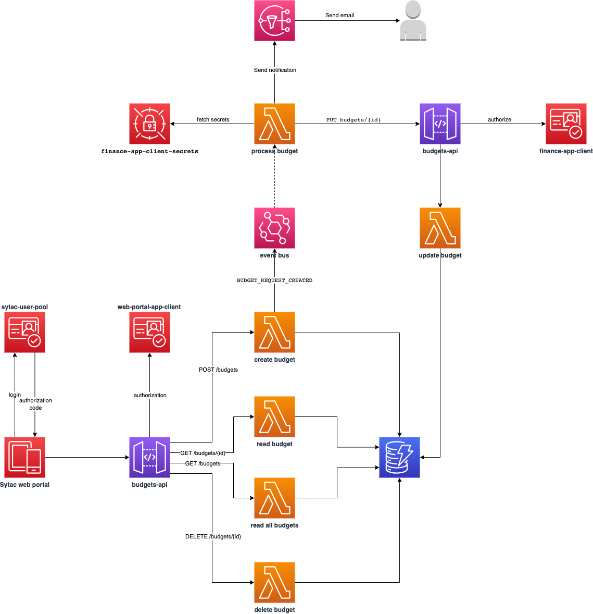

# Serverless workshop

This project is a simplified Sytac budget management service implemented using AWS serverless.

It consists of CRUD APIs exposed by API Gateway and secured and access controlled by AWS Cognito (OAuth 2.0 implementation).
We are using two types of OAuth 2.0 grant types:

-   Authorization code grant type - for the users of Sytac web portal
-   Client credentials grant type - for the finance app

The web portal user needs to signup in order to create/access budgets.

The finance app is represented by `event-bridge-handlers#processBudget` function:

-   approves budget lower/equal than `€20`
-   declines budget higher than `€300`
-   pending for manual approval

It sends an email notification to the owner of the budget after the budget has been processed.

[Architecture diagram](https://viewer.diagrams.net/?tags=%7B%7D&target=blank&highlight=0000ff&edit=_blank&layers=1&nav=1&title=sytac-budgets.drawio#R7V1Zk5s4EP41rtp9YApx2o%2BDj%2BxuJbWzGac2m5cpGWRMBpCD8cw4v34lQFzyOcaW7TA5BlqHdXR%2F%2FSE1ckftB28fIjiffcIO8juK7Lx11EFHUXq6Rv6nglUq0EE3FbiR56QiUAgevZ8oE8qZdOk5aFHJGGPsx968KrRxGCI7rshgFOHXarYp9qufOocu4gSPNvR56b%2BeE89SaVcxC%2FkfyHNn7JOB0UtTAsgyZz1ZzKCDX0siddhR%2BxHGcXoVvPWRT8eOjUtabrQhNW9YhMJ4nwLjZ3v%2BPfz2Y4RUbbK0vwUvwQ%2FJSGt5gf4y6%2FArmkhzHMXQl%2BB8Ltm%2BR%2BtPexCv2LAsnlFs0%2F7JHdWaYy%2BMk3HWLfKXNKOf%2FtNJ1j6V3Cn6GuE6mckLAZ%2BN%2FALrPqEuXCczeSHgs9E71uqqcJ3M1PkW10uDNaVBrTT5q1p4GfteiPq5RtMxnuIw7mMfR8n4q%2BTPiE6z5UbQoTNUShvpmqn1SmkDLyIVeTgk6SGZ2hmtz%2FP9Upm%2BCVRANMdaxBF%2BRqWUafJDUhy4mCEna84LimKPWMlHOEH%2BA154WfUxnpdS733PpdIJjmMckASYCWzSKkQ%2BwJrFgU%2FuQdbDzP6Bwu4zjaPpcDFPh2PqvdF2WMSg5jQxeHMp9NzB14V2F6EFXkY2%2BtOm7bHIbXpVzWVjN%2FRiTCuZQ9sL3TFt90AtBB%2FRlH6WREV%2BrZN56zPjIb1FbxutEuS2TjAS4QDF0YpkyQoo3QweGD4yuHgt0MbMIHNWAhomgxm%2BuXnNBQSQiwwFDkAEk0OEqRfC0EYtHLRwcCgc5IZfR4QUJy4PDhqwaCDXTBqINmlV5QwWOYTlZLdUBbCLQ%2BgPC6kV4WXo5BNc5PmIE6ikU%2FAdxfEqmyO4TMavNIFkuKLV16x8cvMfvSEqn90O3sqJg1X57gFFHuk8VYpEmHaAtnr7rJBOJvO9ZTQYs4xh5KJ4S0aaa908R8iHsfdSbcm6SUuK3kcRXJUyZOhY1PxABYX6aGqvoj2mWaN1O%2FLreq%2BmMGkLCvXJu3KERnU5L%2FHw9%2BO4QzV9NFmSaUq7yOlcAhBVPeFAoI4Vgec4qUqihfcTTpL6eEcz2Ga%2B2eNBVrgg5WUF2mI7G42dwLpsaJUJyIztMC3hphVUK9Wq5fF0ukAxBwxNzKzWYsV7sEIXghU1T2P2dmBFPX%2FWotNiRY%2FDig%2FDOlSMOqZFajEHN4Ia2lbUkOQ7oGpKI0CRY%2FEZsEFvseE92GBeAo%2FoqofxCCCrZyASzAhK4DAYfhyOhzeODxvcRYEPZlerMgAJNAIXbMDZLIPe2dDDaNHjPehhXAKz6ILDmEXXNM8AHmAPZnETcLFBBwq4MFS1GTrB2nR6PGAWUJq9bNIkOPe4iWuXGCuyi1pi7Gn6YKQctsSo36uypf8yS4xEpZ9cGKNXCoKn2DgwDcGrjEDn7NnHrheK8Pr5XmvTXpttQe%2Fy2mDDA%2BBpvbZRU4kdTnt79tP47Hyoz8sC37z4a%2Bm6xAHJXUEB6c2qdFMngBfLJvfWS%2FlIvTwOInjC9riKoU1RC01o35PAg9b3X5Hvb7cXd%2Fr%2BAE%2B8BMcacPvapXn9rhA8z3GYqnMZit8DxMw7sMoyB8Gcxf7uoUlE1%2FZF9A36ciZE5xf3yWzNcESekRMjVQyftN6aROTKpVc2dtBtPJWnqr9ta5CgXMVaj1zCO8MzucZN54I6aGm5QJE0x7j1za1v%2FhUiAWnPThn2V3PjwqP%2BNMEhQnfHe%2FEGna%2Bi7Ol8lQ0u4LSP%2BWavFvJjnOHBXeNDfphzd7yXiuoYP5Y4dfUJdtzTAXEnv3Up0iky%2B%2FV7MmcyNW5pCgPPX6VZSXkYUOzIavkLxVYEvZAMiPwJh7ienlYXkBRqwSnNNvK0lHRYXwYfhuOnz8N%2Fvgwfx0%2F9z8P78XDA2k%2FGI%2BlCmleEIYjQXa2RbWlOOVn8WR65JNd2FNKGZaWapzCs%2FyU9tSMEY0I65XR%2FoaUw10RhzO5Q1g6jMANZ7wPzl1le8GEwcSAjLAR%2BHBSxPoc4RHkKtJ%2FdBKpqqQ3wmZzAXAyhuag4RkX0ArGin4vRHDVrrJkl8CbY7bTQ3UL3bUP3CSDY6CqCIfiiwkVN4RBsXAcE868EZxAMk8KbAqtaJG6RuEXitUjcZSH6wpBYcOhtdXUPiAZi8zqAmH8T20E%2BahcyWgxuMfhgDAYyW4cUBcLKugX01oCvxoC1gUkSDzNg8qNZvYs1YLlhA3ZWIQywM2nGhM16fKroWCddFkGjcgVpeKNI25cGaT2RNEjjaRB6Sc6gISyofQy9JgQdjbRR1zoMQa0%2BUHXjYhG0aQqUqPYk8hIDP2kESp0gqaJ3bPT2lBoOdPdAZ11o%2FKfOBwxeT1TIw5dxeUGz9I753nEhVxe0qm8%2Fz0aiB9rUwoukhk60Mau1AqVaw%2BmiWg0hvC1HFnCtyCKU9xmAQ5ZpQu1IF5Ed3cy73caGN7LyKHLVlE9yEkQtNl062zEyTAFLMzuPsI0Wi3Zl8yppfbuyKXRlUzhxN0W41wY9og729YiKUK59UfEUomnM3pN2bJjzcXPGR1Ow9%2BNu5C04fedRVkDv6hXEUhrhL9U62bnVp6cvOk9M23NrrpO5tOfWnP%2FcmjwY5mLoi9g32C9sdUBX9nSrYoNjWDNLILycO%2B1bPlcKxO0j5FkfIesYLH7vh18S2rWNMMnfZpJqOwoKpaR09b98ke0rXM7mA%2F%2BtKlK%2BrrnX9kOLZxeMZ%2B2hSLvwLFP2pwCG0D3VtykJJ5eKkE3tBvng3ucUH3tM8XHDzG9D144huoWlFmXD3q2I84TIbfHVhWn24vsf1eH%2F)



## Requirements

-   Package manager: yarn (https://classic.yarnpkg.com/lang/en/docs/install)
-   Node version manager: nvm (https://github.com/nvm-sh/nvm#installing-and-updating)
-   NodeJS 18 - `nvm install 18`

## Installation

### Install Nodejs version 18

First time using Node? Then follow this link:
https://nodejs.org/en/download

If you are familiar with Node ecosystem, you might prefer installing Node 18 using Node version manager:
https://github.com/nvm-sh/nvm

### Install yarn

I prefer using `yarn` as a package manager, but feel free to skip this step if you prefer to use `npm`.

```shell
npm install --global yarn
```

### Install AWS CLI

https://docs.aws.amazon.com/cli/latest/userguide/getting-started-install.html

For mac users:

```shell
brew install awscli
```

Configuring AWS CLI will be done during the workshop, so skip this step for now:

```shell
aws configure --profile sytac-workshop
```

### Install project dependencies

```shell
yarn
```

## Deployment

Since this application will be deployed by the workshop attendees, we will deploy the same application in different environments,
without interfering each other deployment and functionality. To do so, we need to change the stage property in both serverless
config files, `serverless-infra.ts` and `serverless-functions.ts`, for example you can set your name:

```
const serverlessConfiguration: AWS = {
    ...,
    provider: {
        ...
        stage: 'aldo',
        ...
    },
    ...
}
```

Also in order to receive budget notification email, you need to put your email in `serverless-infra.ts`:

```
BudgetNotificationEmailSubscription: {
    Type: 'AWS::SNS::Subscription',
    DependsOn: ['BudgetNotificationSns'],
    Properties: {
        Protocol: 'email',
        Endpoint: 'aldo@example.com',
        TopicArn: { Ref: 'BudgetNotificationSns' },
    },
}
```

Deployment can take around 5 minutes.

```shell
# deploy infra resources
yarn deploy:infra

# deploy functions
yarn deploy:functions
```

After `infra` stack has been deployed you should have received an email `AWS Notification - Subscription Confirmation`,
then you should confirm the subscription in order to receive email notifications.

Before starting to consume the APIs, you must store `finance-app` client secrets in the secrets manager
with name `${self:provider.stage}-finance-app-client-secrets` and containing this structure:

```json
{
    "id": "{client_id}",
    "secret": "{client_secret}"
}
```

## Test

Import `misc/postman/sytac-budgets-api-collection.json` in Postman.

## Cleanup

Deleting the deployed application resources, should be done in the reverse order of deployment.

```shell
# delete functions
yarn remove:functions

# delete infra resources
yarn remove:infra
```

As a last step delete the `${self:provider.stage}-finance-app-client-secrets` in secrets manager.
